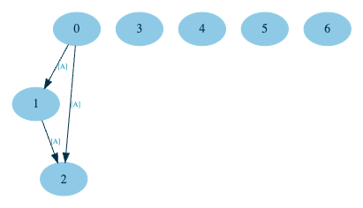
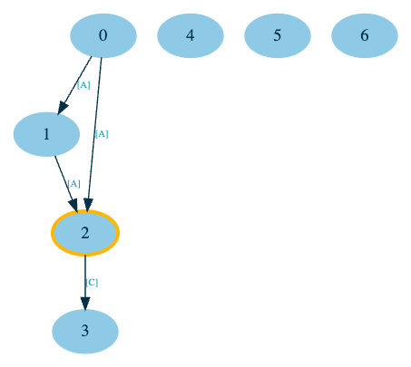
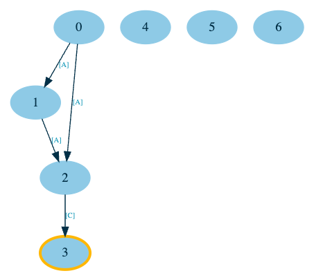
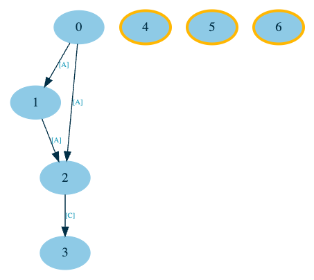

# Concurrent transaction processing

## Background

Transactions arrive to the system in an ordered sequence, where the `N`-th transaction can only affect the `N+M`-th transaction, but not the other way around. 
In other words, if two transactions `N` and `N+1` update the same state, `N` should always be executed before `N+1`.

To determine how to efficiently and deterministically execute the transactions concurrently, we must first determine their dependency structure.

This would be easy if the dependencies were statically defined (e.g. at compile-time, in which case we could compile the transaction to have the full knowledge of its dependencies). 
But that is not the case here, since our executor is only given a state update function (struct that implements `types.Transaction` interface), which can contain arbitrary code and have different dependencies or dependants depending on the current state.

See [instructions.pdf](./instructions.pdf) for more info about task requirements.

## Design

Our algorithm will need to keep track of the dependencies over time. 
To do this, we will record the reads and updates of each transaction execution and incrementally build the correct DAG (Directed Acyclic Graph) of dependencies between different transactions.
We'll use this graph to determine which transactions are independent and can be executed concurrently with a modified topological sort algorithm. 

At each step during our DAG traversal, we will execute the next transaction in the DAG and compute the changes in its dependencies/dependants to determine how that affects the DAG and current state. 

There are a few important cases here:
1. **added dependencies** - stop the traversal from the current node, revert any state changes made, and continue by re-executing the current transaction.
2. **added dependants** - revert any state changes made by the subgraph of the dependants and re-execute it
3. **removed dependants** - revert any state changes made by the subgraph of the dependants and re-execute it

Terminology definitions for clarity:
- dependency - transaction (represented as `ExecutionNode` in code) which updates the state read by the current transaction
- dependant - transaction (also represented as `ExecutionNode` in code) which reads the state updated by the current transaction

## Example

In this example we will use these example transactions:
- `Transfer{From, To, Amount}` - [transactions/transfer.go](./transactions/transfer.go)
- `Mint{To, Amount}` - [transactions/mint.go](./transactions/mint.go)

Let's say our concurrent executor receives the following transactions:

```go
{
    // First 3 transactions are inter-dependant
    transactions.Transfer{From: "A", To: "B", Value: 10},
    transactions.Mint{To: "A", Value: 20},
    transactions.Transfer{From: "A", To: "C", Value: 20},
    // This transaction will first be treated as independent,
    // but should be moved to the dependency subgraph
    // after the above transaction is re-executed.
    transactions.Transfer{From: "C", To: "D", Value: 20},
    // Next 3 transactions are independent
    transactions.Transfer{From: "E", To: "F", Value: 10},
    transactions.Transfer{From: "G", To: "H", Value: 10},
    transactions.Transfer{From: "I", To: "J", Value: 10},
}
```

First, the executor will optimistically execute all the transactions concurrently to obtain the initial DAG. 
The initial graph may not be final or correct, 
since all transactions are executed against the initial state
(reads and updates could be different if they were instead executed against the correctly updated state).

In our case, the 3rd transaction won't output the correct updates, so DAG will have a missing edge from node 2 to 3, since account A doesn't have sufficient balance in the initial state.



Next, we'll start traversing the graph and observe that we don't have to re-execute nodes 0 and 1, because:
- node 0 doesn't have any dependencies, so nothing could impact its output since the initial optimistic execution
- node 1 doesn't have any reads, which again means that nothing can impact it's output

So the first node that we'll have to re-execute is node 2, because it depends on the state updates from nodes 0 and 1.

After re-execution of node 2, we see that it has new state update outputs `[A, -20], [C, +20]`, meaning it has a new dependant node 3 (since 4th transaction reads from `C`).




To resolve the above scenario, we'll have to re-process node 3 and write the new updates to state, which is done in the next step here.



And once we are done with traversal of all sub-graphs, we are left with disconnected nodes that represent independent transactions, so we can execute them all concurrently.




At the end we have our final updated state:

```go
{
    {Name: "A", Balance: 0},
    {Name: "B", Balance: 10},
    {Name: "D", Balance: 20},
    {Name: "E", Balance: 0},
    {Name: "G", Balance: 0},
    {Name: "I", Balance: 0},
    {Name: "F", Balance: 10},
    {Name: "H", Balance: 10},
    {Name: "J", Balance: 10},
}
```

## Practical considerations

Concurrent execution may not be the most performing approach for all transaction patterns. 
In the worst case, where each transaction `N` depends on the previous one `N-1`, 
we may end up with a DAG that has the longest path equal to the number of transactions. 
This means it's at least as bad as the sequential execution, but in practise it can be even worse due to scheduling overhead that is involved in concurrent execution of threads / Goroutines.

So the performance of concurrent execution largely depends on:
- the length of the longest path through the DAG
- the number of extra executions needed to build the DAG

In a real world implementation, the execution engine may implement some kind of heuristic to determine whether to use sequential or concurrent execution like:
- connectedness of the DAG
- the status of state caches (concurrent execution may be beneficial if we need to make lots of blocking calls to read data from disk)
- ...
