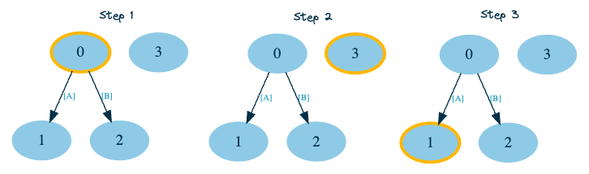
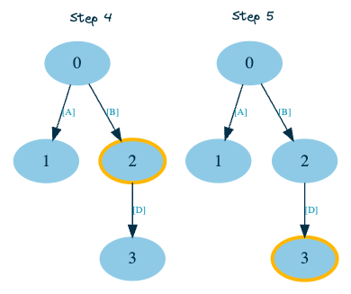

# Concurrent transaction processing

## Background

Transactions arrive to the system in an ordered sequence, where the `N`-th transaction can only affect the `N+M`-th transaction, but not the other way around. 
In other words, if two transactions `N` and `N+1` update the same state, `N` should always be executed before `N+1`.

To determine how to efficiently and deterministically execute the transactions concurrently, we must first determine their dependency structure.

This would be easy if the dependencies were statically defined (e.g. at compile-time, in which case we could compile the transaction to have the full knowledge of its dependencies). 
But that is not the case here, since our executor only receives a Go function reference, which can contain arbitrary code and have different dependencies depending on the current state.

See [instructions.pdf](./instructions.pdf) for more info about task requirements.

## Design

Our algorithm will need to keep track of the dependencies over time. 
To do this, we will record the reads and updates of each transaction execution and incrementally build the correct DAG (Directed Acyclic Graph) of dependencies between different transactions.
We'll use this graph to determine which transactions are independent and can be executed concurrently with a modified topological sort algorithm. 

At each step during our DAG traversal, we will execute the next transaction in the DAG and check if reads or updates changed since the last execution. There are two important cases here:
1. **new dependencies are found** (transactions that update the state that the current transaction reads) - stop the traversal from the current node, revert any state changes made, and continue by re-executing the current transaction.
2. **new dependants are found** (transactions that read the state that the current transaction updates) - revert any state changes made by the subgraph of the dependants and re-execute it

## Example

In this example we will use a simple transfer transaction - here is the source code (also located in [transactions/transfer.go](./transactions/transfer.go)):

```go
type Transfer struct {
	From  string
	To    string
	Value uint
}

func (t Transfer) Updates(state types.AccountState) ([]types.AccountUpdate, error) {
	fromAcc := state.Get(t.From)
	if fromAcc.Balance < t.Value {
		return nil, fmt.Errorf("insufficient balance")
	}
	return []types.AccountUpdate{
		{Name: t.From, BalanceChange: -int(t.Value)},
		{Name: t.To, BalanceChange: int(t.Value)},
	}, nil
}
```

Let's say our concurrent executor receives the following transactions:

```go
{
    transactions.Transfer{From: "A", To: "B", Value: 10},
    transactions.Transfer{From: "A", To: "C", Value: 10},
    transactions.Transfer{From: "B", To: "D", Value: 10},
    transactions.Transfer{From: "D", To: "E", Value: 10},
}
```

First, the executor will optimistically execute all the transactions concurrently to obtain the initial relationships. 
These relationships may not be final or correct, 
since all transactions are executed against the initial state
(reads and updates could be different if they were instead executed against the correctly updated state).

In our case, the 2nd transaction won't output the correct updates, since account B doesn't have sufficient balance in the initial state. 

Next up, we'll build the initial DAG and start executing transactions without any dependencies (steps 1 and 2).
After those are executed, and if no changes in their dependencies were found, 
we continue our depth first traversal and execute their descendant transaction nodes (step 3).



Things get more interesting when we execute the 2nd transaction.
Because the 0-th transaction transferred balance from account `A` to `B`, account `B` now does have sufficient balance for the current transfer,
which means the 2nd transaction will output the correct balance updates this time (`B`-10, `D`+10). 
And since we already knew that the 3rd transaction reads the state from account `D` (which the 2nd transaction updates), we can now update the DAG to reflect that and re-execute the 3rd transaction (note: we must also ensure the state update from previous execution is discarded).



After we are done with executing the last (3rd) transaction and if we find no new dependants / dependencies, we can be sure the state is correct and final:

```go
{
    {Name: "A", Balance: 0},
    {Name: "C", Balance: 10},
    {Name: "E", Balance: 20},
}
```

## Implementation

There are currently two implementations:
- `/executor/serial` - sequential (non-concurrent) executor used for testing and benchmarking
- `/executor/parallel` - concurrent executor
